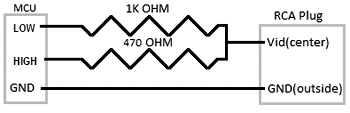

# TVOut-Micropython
Composite video generation library for MicroPython<br/>
Tested on ESP32-S3 platform<br/>
Uses framebuf library<br/>
Generates monochrome NTSC signal using RMT peripheral<br/>
Currently resolution is limited to 104x80<br/>
## Installation using MIP:
```
import mip
mip.install("github:Voinic/tvout-micropython")
```
## Usage:
```
from tvout import TVOut

PIN_H = Pin(47)
PIN_L = Pin(48)

tv = TVOut(PIN_L, PIN_H)

tv.fill(0)
tv.text("hello", 0, 0, 255)
tv.show()
```
## Sample output from tvout_test.py example

## Schematics<br/>
